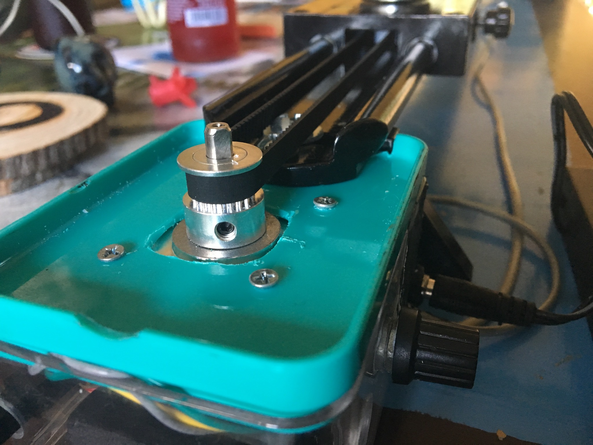
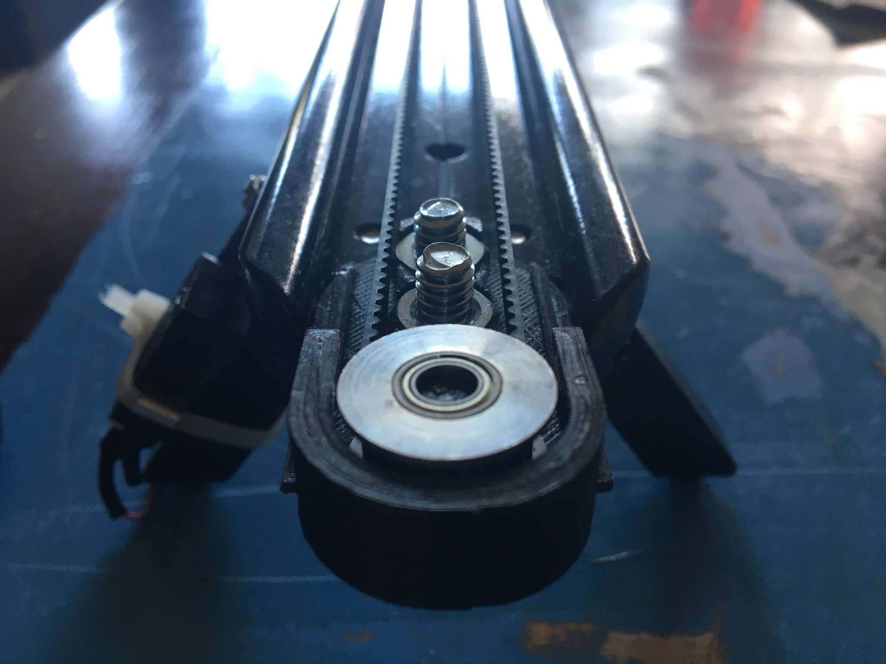

# Slider

Arduino driven mechanical video slider.

[Parts list](https://docs.google.com/a/camlittle.com/spreadsheets/d/1xlj7D98955wYuXj9ept1h3pb_NClaukpYvvVbXTrUsw/edit?usp=sharing)

## Finished project





## Features

- Auto calibration
- Simple oscillation between each end
- Single direction movement towards the end
- Speed control

## Code

The code is controlled by a basic state machine, paired with global application
state and event triggers. When powered on, the system enters the
CalibratingFindLeft state.

Each button produces buttonDown and buttonUp events as they are pressed and
released.

These are the main state transitions:

```
Stopped
  - main buttonUp -> OscillatingLeft
  - left buttonUp -> MoveLeft
  - right buttonUp -> MoveRight
OscillatingLeft
  - position at left side -> OscillatingRight
  - main buttonDown -> Stopped
OscillatingRight
  - position at right side -> OscillatingLeft
  - main buttonDown -> Stopped
MoveLeft
  - position at left side -> Stopped
MoveRight
  - position at right side -> Stopped
CalibratingFindLeft
  - left buttonDown -> CalibratingFindRight
    (record "0" point)
CalibratingFindRight
  - right buttonDown -> CalibratingReset
    (record slider length)
CalibratingReset
  - position past center -> Stopped
```

In most cases, when in motion buttonDown events on the direction of motion's
switch automatically adjust the internal calibration. There are a few other
event handling checks to safeguard against unexpected behavior.

## Resources

These two DIY slider designs contributed heavily towards ours.

- http://s.co.tt/2015/04/24/diy-motion-control-camera-slider/
- https://learn.adafruit.com/bluetooth-motorized-camera-slider
